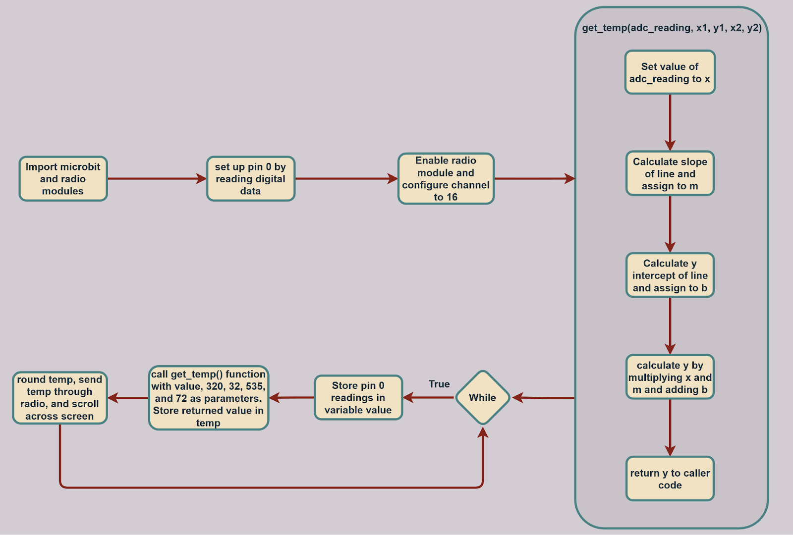

# Microbit_Lesson_14
Lesson 14 of my Intro to Python course with Microbit

Program Overview: This program is a temperature sensor that behaves like a thermometer. It is made using python and uses an externally connected thermistor to read temperature data in the surrounding environment. It then parses this data and converts it into Fahrenheit and scrolls it across the screen. It also sends the temperature through the inbuilt radio.

New Learnings: One new learning from this lesson was regarding a built-in python math function called round(). This function takes a floating-point argument and rounds it to the nearest whole number. Effectively converting it to an integer. In the context of this program, it was used to round converted temperature data so that it wasn’t an unusual value.

Real-World Connections: One real-world connection made with this program is thermostats. Everyone has a thermostat in their house and they are essential to any building in the urban world. This program behaves similarly to a thermostat as they both utilize a thermistor to read the temperature in the surrounding environment. Although the difference lies in what they do with these data readings, the thermostat adjusts the air conditioning to reach the desired temperature, whereas this program displays it on the screen and sends it through the radio. 

Applications: One application for this program would be in making an application that tells users what to wear on certain days. The program could utilize the thermistor and take in readings of the temperature of the surrounding environment. Then it could interpret this data using various conditions to then output a recommendation of what to wear. For example, if the temperature is 80 degrees Fahrenheit, the output could say short sleeves and shorts. Additionally, the photoresistor could be used to monitor light levels and recommend eyewear such as sunglasses.

